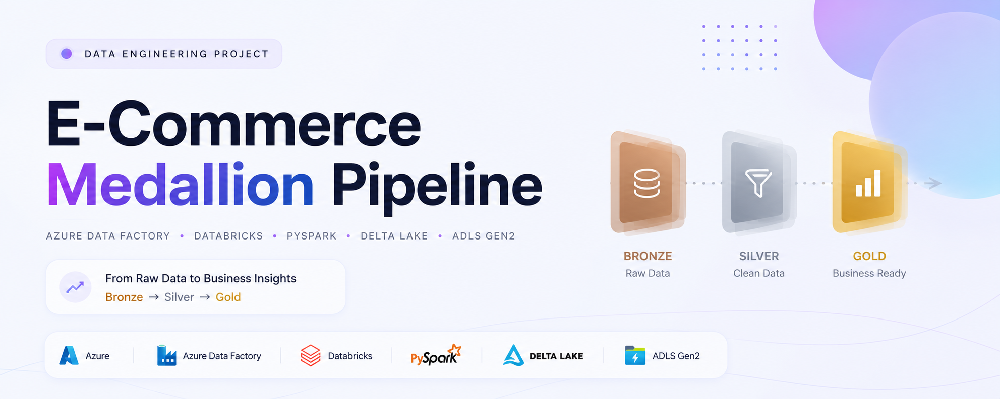
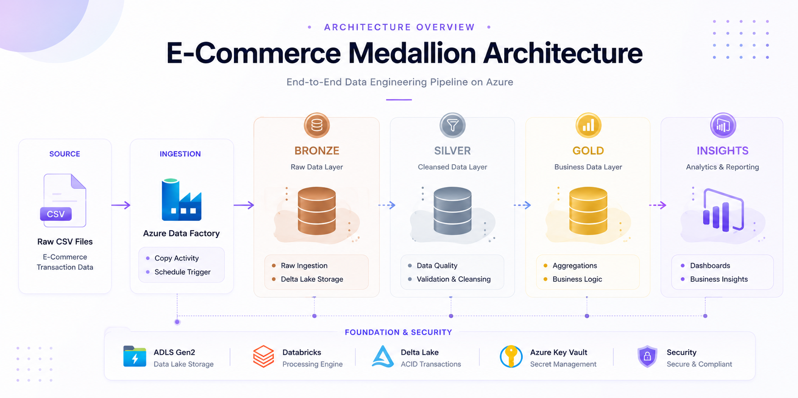
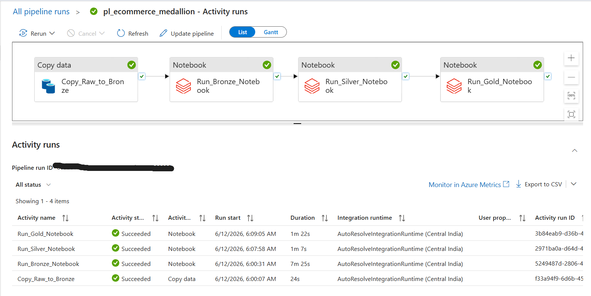
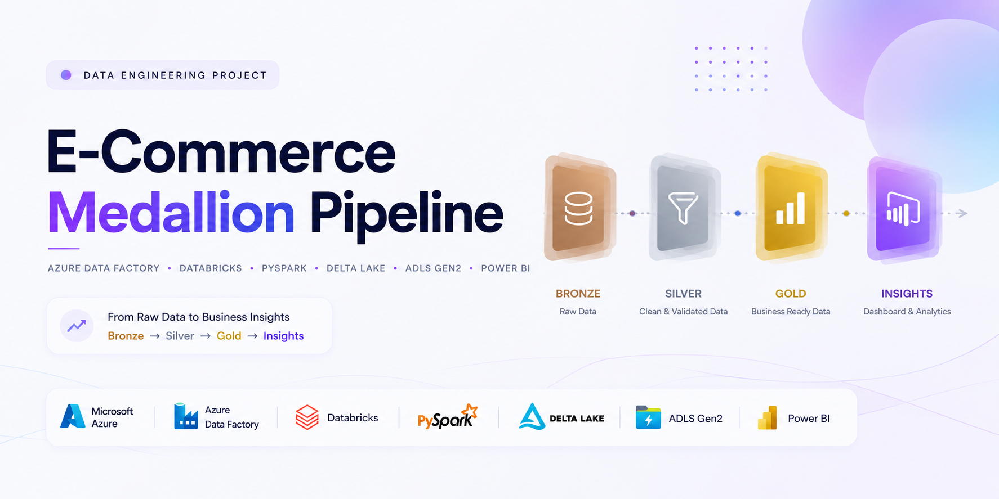
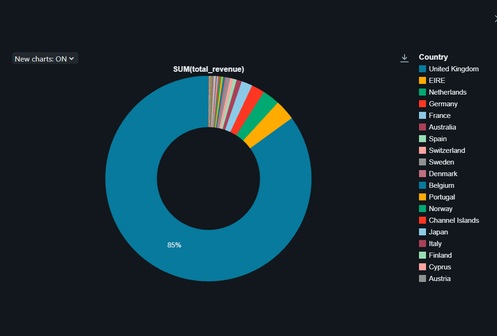
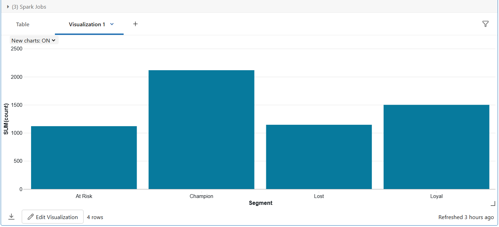
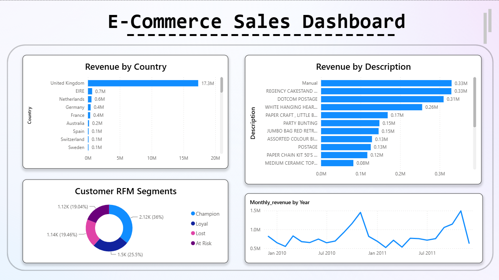

<p align="center">
  
</p>

<h1 align="center">E-Commerce Medallion Pipeline</h1>

<p align="center">
End-to-end Azure Data Engineering solution using Azure Data Factory, Databricks, PySpark, Delta Lake and Power BI to process 1M+ retail transactions and deliver business-ready analytics.
</p>

<p align="center">


</p>

---

## 🚀 Overview

A modern Azure Data Engineering solution implementing the Medallion Architecture (Bronze → Silver → Gold) to process over **1 million retail transactions** and deliver business-ready insights through **Power BI dashboards**.

### Key Achievements

- ✅ Processed 1,067,371 retail transactions
- ✅ Built Bronze → Silver → Gold architecture
- ✅ Automated execution using Azure Data Factory
- ✅ Implemented data quality framework
- ✅ Created business-ready Gold layer tables
- ✅ Performed customer RFM segmentation
- ✅ Built interactive Power BI dashboard
- ✅ Delivered executive-ready business reporting
- ✅ Secured secrets using Azure Key Vault

---

## 📊 Project Snapshot

| Metric | Value |
|----------|----------|
| Dataset Size | 1,067,371 Rows |
| Architecture | Bronze → Silver → Gold |
| Processing Engine | Databricks + PySpark |
| Storage | ADLS Gen2 |
| Orchestration | Azure Data Factory |
| Visualization | Power BI |
| Storage Format | Delta Lake |
| Security | Azure Key Vault |
| Schedule | Daily 6:00 AM IST |

---

## 🏗️ Architecture

<p align="center">
  
</p>

### End-to-End Data Flow

```text
Raw CSV Files
      ↓
Azure Data Factory
      ↓
Bronze Layer
(Raw Data)
      ↓
Silver Layer
(Cleansed Data)
      ↓
Gold Layer
(Business Analytics)
      ↓
Power BI Dashboard
(Business Insights)
```

---

## ⚙️ Tech Stack

| Layer | Technology |
|---------|---------|
| Storage | Azure Data Lake Storage Gen2 |
| Ingestion | Azure Data Factory |
| Processing | Azure Databricks |
| Transformation | PySpark |
| Storage Format | Delta Lake |
| Visualization | Power BI |
| Security | Azure Key Vault |
| Scheduling | ADF Trigger |

---

## 🔄 Pipeline Execution

<p align="center">
  
</p>

### Pipeline Workflow

```text
Copy_Raw_to_Bronze
        ↓
Run_Bronze_Notebook
        ↓
Run_Silver_Notebook
        ↓
Run_Gold_Notebook
```

### Schedule

- Daily Automated Execution
- Azure Data Factory Trigger
- 6:00 AM IST

---

## 🧹 Silver Layer – Data Quality Framework

| Issue Found | Resolution | Business Reason |
|-------------|------------|-----------------|
| 243,007 Null Customer IDs | Flagged as Guest Orders | Revenue remains valid |
| 19,494 Cancellation Invoices | Added is_cancelled flag | Preserve transaction history |
| Negative / Zero Prices | Removed | Invalid revenue values |
| Customer ID Formatting Issues | Standardized | Consistent joins |
| Missing Product Descriptions | Retained | StockCode identifies product |

---

## 📈 Gold Layer Outputs

### 🌍 Revenue by Country

<p align="center">
  
</p>

### 👥 Customer RFM Segmentation

<p align="center">
  
</p>

---

## 📊 Power BI Dashboard

<p align="center">
  
</p>

### Dashboard Capabilities

#### 🌍 Revenue Analytics

- Revenue by Country
- Revenue by Product Description
- Top Revenue Generating Products

#### 📈 Trend Analysis

- Monthly Revenue Performance
- Historical Sales Trends

#### 👥 Customer Analytics

- RFM Segmentation
- Champion Customers
- Loyal Customers
- At Risk Customers
- Lost Customers

#### 💡 Business Insights

- Country-wise Revenue Distribution
- Product Performance Tracking
- Customer Value Analysis
- Revenue Trend Monitoring

---

## 🎯 Business Outcomes

The Gold Layer delivers business-ready datasets for reporting, analytics and customer intelligence.

### Generated Tables

| Table | Description |
|---------|---------|
| revenue_by_country | Country-wise revenue analysis |
| monthly_sales_trend | Monthly sales performance |
| top_products | Top-performing products |
| customer_rfm | Customer segmentation |

### RFM Segment Distribution

| Segment | Customers |
|---------|-----------|
| Champions | 2,116 |
| Loyal | 1,499 |
| At Risk | 1,119 |
| Lost | 1,144 |

---

## 📂 Power BI Report

The complete Power BI report is included in this repository.

```text
powerbi/ecommerce_sales_dashboard.pbix
```

Open the PBIX file directly in Microsoft Power BI Desktop.

---

## 🔐 Security

- Azure Key Vault for secret management
- No credentials hardcoded in notebooks
- Secure ADLS Gen2 access
- Managed authentication between Azure services

---

## 📁 Repository Structure

```text
ecommerce-medallion-pipeline/
│
├── 01_bronze_ingest.py
├── 02_silver_transform.py
├── 03_gold_aggregate.py
│
├── powerbi/
│   └── ecommerce_sales_dashboard.pbix
│
├── images/
│   ├── banner.png
│   ├── ecommerce_medallion_architecture.png
│   ├── adf_pipeline_success.png
│   ├── revenue_by_country.png
│   ├── customer_rfm.png
│   └── powerbi_dashboard.png
│
└── README.md
```

---

## 🚀 How To Run

1. Upload source dataset to ADLS Gen2
2. Configure Azure Key Vault secrets
3. Import notebooks into Databricks
4. Create Bronze, Silver and Gold storage locations
5. Configure Azure Data Factory pipeline
6. Add schedule trigger
7. Execute pipeline
8. Connect Gold tables to Power BI
9. Build dashboards and publish reports

---

## 📊 Dataset

**Online Retail II Dataset**

Source: UCI Machine Learning Repository

- 1,067,371 Transactions
- UK-based Online Retail Business
- Period: 2009 – 2011
- Transaction-Level Data

---

## ⭐ Features

- Azure Data Factory Orchestration
- Azure Databricks Processing
- PySpark Transformations
- Delta Lake Storage
- Medallion Architecture
- Data Quality Framework
- Customer RFM Segmentation
- Power BI Dashboard
- Revenue Analytics
- Business Reporting
- Automated Daily Execution
- Business Analytics Tables

---

## 👨‍💻 Author

### Aman Singh

Data Engineering | Azure | Databricks | PySpark | SQL | Delta Lake | Power BI

---

<p align="center">
⭐ If you found this project useful, consider giving it a star.
</p>