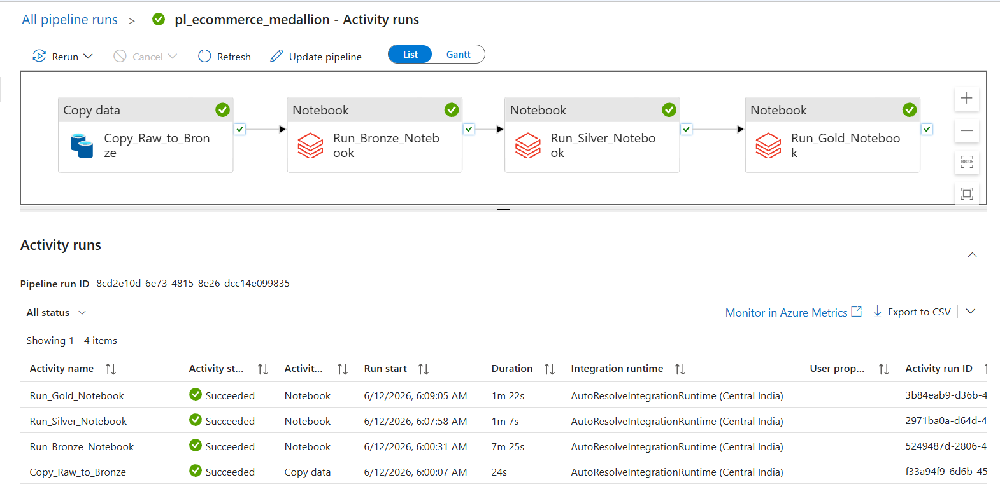

# 🛒 E-Commerce Medallion Pipeline

End-to-end Azure Data Engineering solution built using Azure Data Factory, Azure Data Lake Gen2, Azure Databricks, PySpark, and Delta Lake.

✅ Processed 1,067,371 retail transactions

✅ Implemented Medallion Architecture (Bronze → Silver → Gold)

✅ Automated daily execution using Azure Data Factory

✅ Built business-ready analytics and customer RFM segmentation

---

## 🏗️ Architecture

<p align="center">
  
</p>

---

## 🛠️ Tech Stack

<p align="center">


</p>

---

## 📌 Project Overview

This project demonstrates a real-world Azure Data Engineering pipeline that ingests raw retail transaction data into Azure Data Lake Storage Gen2, transforms it using Databricks and PySpark, and delivers business-ready analytical datasets through a Medallion Architecture.

### Bronze Layer
- Raw CSV ingestion
- Delta format storage
- Preserves source data
- 1,067,371 records

### Silver Layer
- Data quality validation
- Type casting
- Deduplication
- Business rule implementation
- 1,015,458 records

### Gold Layer
- Revenue analytics
- Sales trend analysis
- Product performance analysis
- Customer RFM segmentation

---

## 🔄 Pipeline Execution

<p align="center">
  
</p>

### Workflow

```text
Copy_Raw_to_Bronze
        ↓
Run_Bronze_Notebook
        ↓
Run_Silver_Notebook
        ↓
Run_Gold_Notebook
```

### Scheduling

- Azure Data Factory Trigger
- Daily Execution
- 6:00 AM IST

---

## 📁 Repository Structure

```text
ecommerce-medallion-pipeline/
│
├── notebooks/
│   ├── 01_bronze_ingest.py
│   ├── 02_silver_transform.py
│   └── 03_gold_aggregate.py
│
├── images/
│   ├── ecommerce_medallion_architecture.png
│   ├── adf_pipeline_success.png
│   ├── revenue_by_country.png
│   └── customer_rfm.png
│
└── README.md
```

---

## 🧹 Data Quality Decisions

| Issue Found | Action Taken | Reason |
|------------|-------------|---------|
| 243,007 Null Customer IDs | Flagged as Guest Orders | Revenue remains valid |
| 19,494 Cancellation Invoices | Added is_cancelled flag | Preserve transaction history |
| Negative or Zero Prices | Removed | Invalid revenue values |
| Customer ID datatype inconsistencies | Standardized format | Consistent joins |
| Missing Product Descriptions | Retained | StockCode uniquely identifies product |

---

## 📊 Gold Layer Outputs

### Revenue by Country

<p align="center">
  
</p>

---

### Customer RFM Segmentation

<p align="center">
  
</p>

---

## 📈 Business Outcomes

This pipeline transforms raw retail transaction data into actionable business insights.

### Key Deliverables

- Revenue by Country
- Monthly Sales Trends
- Top Performing Products
- Customer RFM Segmentation

### RFM Distribution

| Segment | Customers |
|----------|----------:|
| Champions | 2,116 |
| Loyal | 1,499 |
| At Risk | 1,119 |
| Lost | 1,144 |

---

## 🔐 Security

- Azure Key Vault used for secret management
- No credentials hardcoded in notebooks
- Secure access to Azure Data Lake Storage

---

## 🚀 How to Run

### Prerequisites

- Azure Subscription
- Azure Data Lake Storage Gen2
- Azure Databricks
- Azure Data Factory
- Azure Key Vault

### Setup

1. Upload Online Retail II dataset to ADLS Gen2
2. Configure Azure Key Vault secrets
3. Import notebooks into Databricks
4. Create Bronze, Silver, and Gold storage paths
5. Configure Azure Data Factory pipeline
6. Add schedule trigger
7. Execute pipeline

---

## 📊 Dataset

### Online Retail II Dataset

Source: UCI Machine Learning Repository

Dataset Characteristics:

- 1,067,371 Transactions
- UK-based Online Retail Company
- Period: 2009–2011
- Customer Purchase History
- Product-Level Transactions

---

## 🎯 Project Highlights

✔ Azure Data Factory Orchestration

✔ Azure Databricks Processing

✔ Medallion Architecture Implementation

✔ Delta Lake Storage

✔ Data Quality Framework

✔ RFM Customer Segmentation

✔ Automated Daily Pipeline

✔ Business Analytics Tables

---

## 👨‍💻 Author

**Aman Singh**

Data Engineering | Azure | Databricks | PySpark | SQL | Delta Lake
